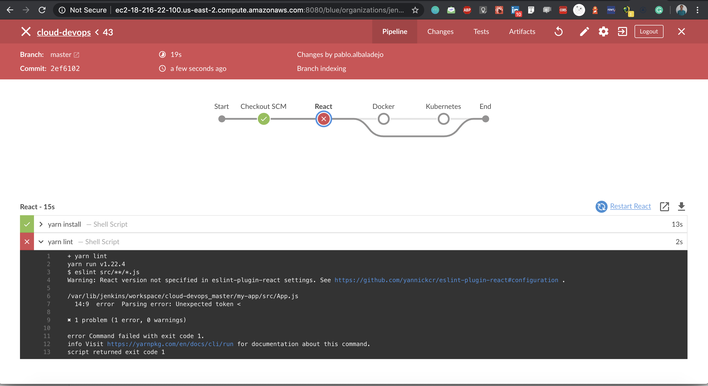

# Cloud devops project

[Rubic](https://review.udacity.com/#!/rubrics/2577/view)

## 1. LOCAL

1. Generate the app build

    `cd my-app && yarn build`

2. Dockerize the app

    `run_docker.sh`

3. Deploy with Kubernetes

    `run_kubernetes.sh`

## 2. Remote

### 2.1 Launch an EKS Cluster

Scripts and templated based on:

[eks cli](https://docs.aws.amazon.com/eks/latest/userguide/getting-started-console.html)

[eks create cluster](https://docs.aws.amazon.com/eks/latest/userguide/create-cluster.html)

[eks Cloudformation](https://docs.aws.amazon.com/AWSCloudFormation/latest/UserGuide/aws-resource-eks-cluster.html)

1. Create a VPC

    In order to create the network infrastructure

    `aws cloudformation create-stack --stack-name cloud-devops-vpc-network --template-body file://./infra/vpc/network.yml --region=us-east-2`

    Template based on [this official guide](https://amazon-eks.s3.us-west-2.amazonaws.com/cloudformation/2020-04-21/amazon-eks-vpc-private-subnets.yaml)

2. Create a Cluster Role

    `aws cloudformation create-stack --stack-name cloud-devops-eks-cluster-role --template-body file://./infra/vpc/cluster.yml --region=us-east-2 --capabilities CAPABILITY_IAM`

3. Create an EKS Cluster:

    `aws cloudformation create-stack --stack-name cloud-devops-eks-culster --template-body file://./infra/eks/cluster.yml --region=us-east-2`

### 2.2 Launch a managed node group

1. Create Amazon EKS worker node role

    `aws cloudformation create-stack --stack-name cloud-devops-eks-nodegroup-role --template-body file://./infra/vpc/nodegroup.yml --region=us-east-2 --capabilities CAPABILITY_IAM`

2. Create Amazon EKS Nodegroup

    [doc](https://docs.aws.amazon.com/AWSCloudFormation/latest/UserGuide/aws-resource-eks-nodegroup.html)

    `aws cloudformation create-stack --stack-name cloud-devops-eks-nodegroup --template-body file://./infra/eks/nodegroup.yml --region=us-east-2`

### 2.3 Deploy Kubernetes

1. Update and rollout

    `run_eks_kubernetes`

# 3. CI/CD

1. Create an EC2 instance

2. Intall Jenkins
    
    1. Plugins line BlueOcean, AWS, etc

    2. Github repo webhook

3. Install node, aws cli and kubectl

4. Run the pipeline

    1. React

        1. Linting

            1. Fail

                

            1. Pass

                

        2. Test

            1. Fail

                

            1. Pass

                

        3. Docker

            

        4. Kubernetes

            